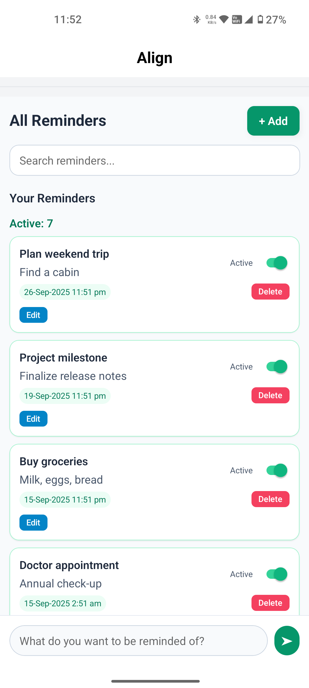
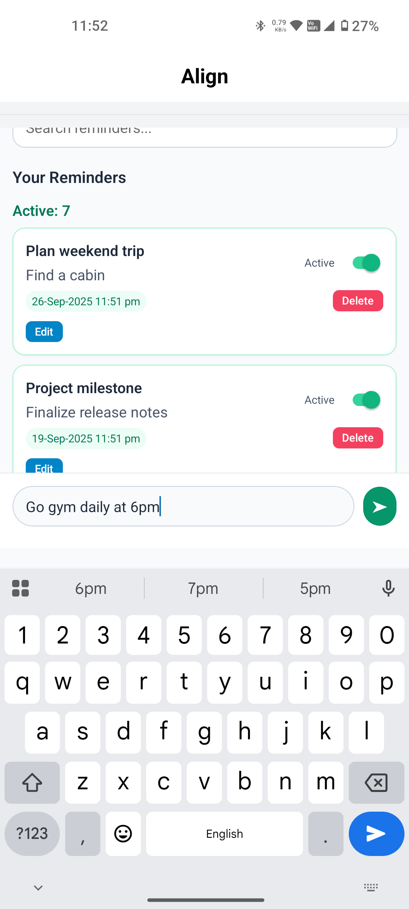
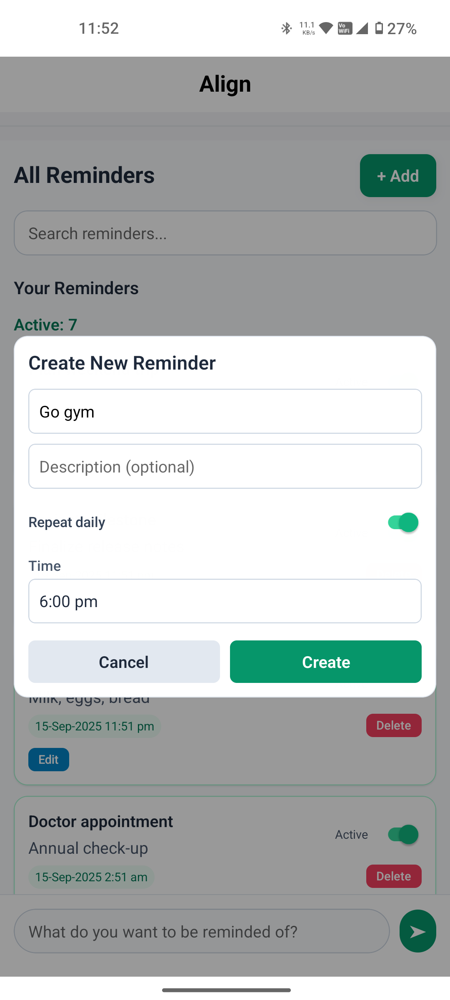
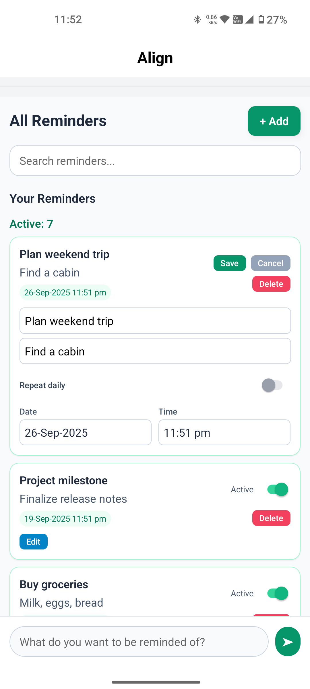
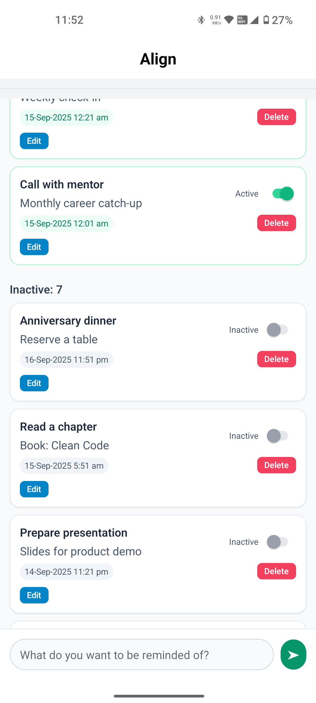
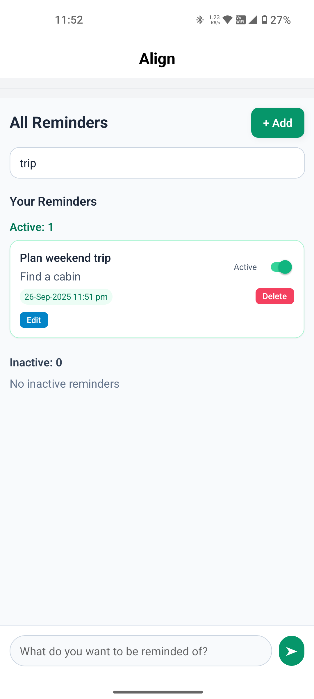
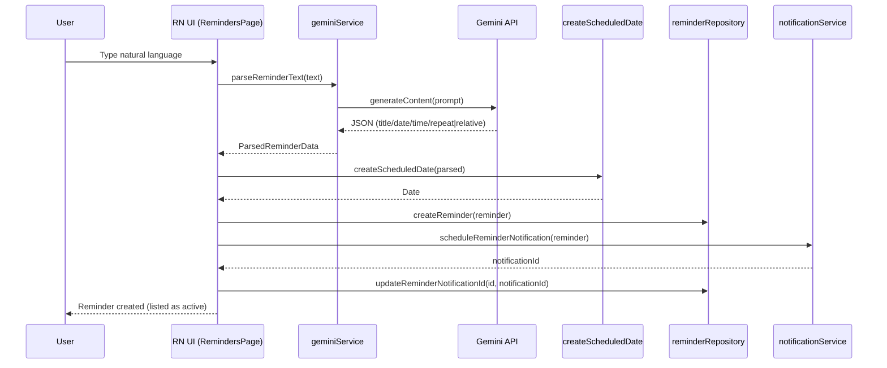

## Align – Smart Reminders & Daily Goals

Align is a React Native + Expo app that helps you stay on track with smart reminders and lightweight daily goals. You can type natural language like “Call mom tomorrow at 2pm” and the app structures it into a reminder, schedules a notification, and stores it locally.

Android is the primary target platform for development and testing.

### Why Align

- Zero-friction reminder creation: type what you mean, the app figures out the rest.
- Local, reliable delivery: reminders are stored locally and delivered as native notifications.
- Practical defaults: intelligent scheduling and a clean UI designed for everyday use.

## Screenshots

The repository contains screenshots in the `images/` folder. Below each filename is listed as the caption to make it easy to identify and select images for release.

- `images/home.png`



- `images/chat_based_reminder.png`



- `images/chat_based_reminder_populated.png`



- `images/edit_reminders.png`



- `images/home_inactive_reminders.png`



- `images/search_reminders.png`




## Features

- Natural-language reminder parsing powered by Google Generative AI (Gemini)
- Fallback parser for common date/time phrases when AI is unavailable
- Local persistence via SQLite (expo-sqlite)
- Push notifications with scheduling (expo-notifications)
- Daily repeating reminders support (reschedules to the next day at the same time)
- NativeWind (Tailwind CSS for RN) for styling
- TypeScript across the app with strict settings

### Engineering highlights

- Strongly typed service boundaries (AI, notifications, persistence)
- Repository pattern for SQLite access (no queries in components)
- Deterministic scheduling helpers and daily repeat semantics
- Testable, modular design with Jest and `jest-expo`
- NativeWind for consistent, maintainable styling

## Tech Stack

- Expo ~53 (React Native 0.79, React 19)
- TypeScript ~5.8
- NativeWind + TailwindCSS
- expo-notifications, expo-sqlite
- @google/generative-ai SDK

## Architecture Overview

- UI (components/)
	- `ScreenContent`, `RemindersPage` compose the experience using functional components and hooks
- Services (services/)
	- `geminiService.ts` – Natural-language parsing with Gemini + resilient fallback
	- `notificationService.ts` – Encapsulates permissioning, scheduling, rescheduling, and cancellation
	- `reminderRepository.ts` – SQLite CRUD via a simple repository layer
- Types (types/)
	- Shared domain types (e.g., `Reminder`)

Flow (high level):
1) User enters natural language → Gemini parses JSON (or fallback parser extracts time/date)
2) Parsed data → `createScheduledDate` determines a concrete Date
3) Reminder persisted via repository → Notification scheduled via service
4) Foreground/background interactions reconcile state and avoid duplicate notifications

## Architecture (HLD + LLD)

This section summarizes the system design at two levels: high-level (how pieces fit together) and low-level (key contracts, workflows, and edge cases) so you can discuss it clearly in interviews and reviews.

### High-Level Design (HLD)

- Clients: Expo/React Native app (Android-first), single binary using JS/TS runtime.
- Local-first: All reminder data lives on-device in SQLite via a repository layer; no server required.
- AI assist: Optional call to Gemini to parse natural language into a structured reminder intent with a robust, regex-based fallback.
- Notifications: Local notifications via `expo-notifications` with an Android channel. Daily repeats reschedule themselves deterministically.
- Styling and type safety: NativeWind + strict TypeScript.

#### System context

```mermaid
graph TD
	subgraph Device[User Device]
		UI[React Native UI]\n(components/*)
		Services[Services]\n(gemini/notification/repository)
		SQLite[(SQLite DB)]
		ExpoNotif[expo-notifications]
	end

	GeminiCloud[(Gemini API)]

	UI --> Services
	Services --> SQLite
	Services --> ExpoNotif
	Services -->|optional| GeminiCloud

	ExpoNotif --> UI
```

Principles:
- Clear separation of concerns: UI never touches SQLite directly; all OS notification APIs are behind `notificationService`.
- Deterministic scheduling: A single helper translates parsed intent to concrete Dates, avoiding drift and “past date” pitfalls.
- Resilience: Fallback parsing covers common phrases; foreground reconciliation prevents duplicates.

### Low-Level Design (LLD)

#### Key modules and responsibilities

- `components/RemindersPage.tsx`
	- Presents chat/manual creation UX, lists active/inactive reminders, supports edit/search.
	- Owns small UX state (modals, pickers) and orchestrates calls to services.
- `services/geminiService.ts`
	- Converts free text → `ParsedReminderData` via Gemini; falls back to regex for common cases.
	- `createScheduledDate(parsed)` resolves absolute Date from relative or absolute signals.
- `services/reminderRepository.ts`
	- CRUD for `Reminder` in SQLite. Converts between JS Date and epoch ms.
- `services/notificationService.ts`
	- Permissioning, channel setup, schedule/reschedule/cancel, get scheduled notifications.
	- Daily repeat: schedule the next occurrence and reschedule after fire.

#### Data model (on-device)

```sql
CREATE TABLE reminders (
	id TEXT PRIMARY KEY,
	title TEXT NOT NULL,
	description TEXT,
	scheduledTime INTEGER NOT NULL, -- epoch ms
	isActive INTEGER NOT NULL,      -- 0/1
	createdAt INTEGER NOT NULL,
	updatedAt INTEGER NOT NULL,
	notificationId TEXT,
	repeat TEXT DEFAULT 'none'      -- 'none' | 'daily'
);
```

Types:
- `Reminder` with Dates in JS runtime, persisted as epoch ms in DB.
- `ParsedReminderData` produced by AI/fallback, consumed by `createScheduledDate`.

#### Core workflows (sequence)

1) Chat-based creation (AI → schedule → persist)



2) Notification fired → reschedule daily → reconcile state

```mermaid
sequenceDiagram
	participant OS as OS/Expo Notifications
	participant UI as RN UI (listeners)
	participant R as reminderRepository
	participant N as notificationService

	OS-->>UI: onReceived / onResponse
	UI->>R: mark reminder inactive
	alt repeat == daily
		UI->>N: rescheduleDailyReminder(reminder)
		N-->>UI: new notificationId
		UI->>R: updateReminderNotificationId(id, newId)
	end
	UI: refresh lists (active/inactive)
```

3) Foreground reconcile (on app focus)

```mermaid
sequenceDiagram
	participant App as AppState(focus)
	participant R as reminderRepository
	participant N as notificationService
	participant UI as RN UI

	App-->>UI: change→active
	UI->>R: getAllReminders()
	UI->>N: getScheduledNotifications()
	UI: compare repo vs scheduled; clean duplicates / stale
	UI->>R: update reminders if needed
```

#### Contracts (selected)

Type inputs/outputs and expected errors to make the service boundaries crisp.

- geminiService
	- `parseReminderText(text: string): Promise<ParsedReminderData>`
		- Errors: network/JSON parse → handled internally by falling back to regex; sets `usedFallback` flag.
	- `createScheduledDate(parsed: ParsedReminderData): Date`
		- If no time provided, defaults to next hour; if time in past, move to next day.

- notificationService
	- `scheduleReminderNotification(reminder: Reminder): Promise<string | null>`
		- Returns notification id; null if permissions denied. Throws if non-daily and time is in the past.
	- `rescheduleDailyReminder(reminder: Reminder): Promise<string | null>`
	- `cancelNotification(id: string): Promise<void>`; `cancelAllNotifications(): Promise<void>`
	- `getScheduledNotifications(): Promise<...>`

- reminderRepository
	- `initDB(): Promise<void>`; `getAllReminders(): Promise<Reminder[]>`
	- `createReminder(r: Reminder): Promise<void>`; `updateReminder(r: Reminder): Promise<void>`
	- `deleteReminder(id: string): Promise<void>`
	- `updateReminderNotificationId(id: string, notificationId: string | null): Promise<void>`

#### Edge cases and policies

- Time zones and “past” handling: absolute times in past roll to next day; relative times add minutes from now.
- Daily repeats: first trigger is the next occurrence at HH:mm; after fire, we reschedule for tomorrow at same HH:mm.
- Permissions: if notifications not granted, scheduling returns null; UI should communicate limited functionality (non-blocking).
- Duplicates: foreground reconcile and idempotent update prevent multiple pending schedules for the same reminder.
- Robust parsing: if AI fails or produces ambiguous fields, we still surface a meaningful title and allow manual corrections.

#### Performance and reliability

- All DB operations are batched through a single connection; data set is small (local-only) → O(1) latencies in practice.
- Notification scheduling is O(1) per reminder; rescheduling occurs only on daily reminders after fire.
- No network dependency for core function (only AI parsing is online optional).


#### Extensibility roadmap

- Recurrence: weekly/monthly/weekday-only using rules (RRULE-like) with a generalized scheduler.
- Cloud sync: small API layer for backup/restore and multi-device, with conflict resolution policies.
- iOS focus: separate iOS notification channel configuration and testing; critical alerts where appropriate.
- Observability: lightweight analytics and error reporting (privacy-first).
- NLP: richer entities (location, participants) and smart templates.


## Getting Started

### 1) Prerequisites

- Node.js LTS and npm
- Android Studio (emulator) or a physical Android device
- Expo CLI (installed automatically by npx commands)

### 2) Install dependencies

```cmd
npm install
```

### 3) Set your Gemini API key

The app reads the key from the environment variable `EXPO_PUBLIC_GEMINI_API_KEY`.

On Windows Command Prompt (cmd.exe):

```cmd
set EXPO_PUBLIC_GEMINI_API_KEY=YOUR_API_KEY_HERE
```

Tip: See `GEMINI_SETUP.md` for details on obtaining a key.

### 4) Start the app (use tunnel)

Different Wi-Fi/LAN names can cause connectivity issues; use the tunnel and clear cache on first run:

```cmd
npx expo start -c --tunnel
```

Then, from the Expo Dev Tools, launch on Android (recommended). You can also press `a` in the terminal to open the Android emulator if available.

Notes:
- The `-c` flag clears the Metro cache and often resolves odd bundling issues.
- Android is first-class; iOS may work but isn’t the focus.

## Scripts

Useful npm scripts defined in `package.json`:

- `npm start` – Start Expo bundler
- `npm run android` – Build and run a native Android project (dev build)
- `npm run web` – Run in a web browser (limited feature parity)
- `npm run lint` – Lint and check formatting
- `npm run format` – Fix lint issues and format code
- `npm test` – Run unit tests
- `npm run test:watch` – Run tests in watch mode
- `npm run test:coverage` – Run tests with coverage

## Core Flows

### Create a reminder via chat (AI)
1) Type: “Dentist appointment on 2025-10-02 at 4pm”
2) `geminiService.parseReminderText` returns structured data (title, date, time, repeat)
3) The app computes a scheduled Date, stores the reminder, and schedules a notification

### Create a manual reminder
1) Open the create modal, pick date/time
2) Persist via repository and schedule a one-off or daily notification

### Daily reminders
- For repeat=daily, the service schedules the next occurrence and relies on rescheduling after each fire to avoid platform quirks

## Testing

The project uses Jest with `jest-expo` preset. Tests live under `tests/`.

Run the full suite:

```cmd
npm test
```

Watch mode:

```cmd
npm run test:watch
```

Coverage:

```cmd
npm run test:coverage
```

Targets include:
- Unit tests for services (`geminiService`, `notificationService`, `reminderRepository`)
- Integration-style tests for flows
- Coverage thresholds enforced at 70%+ for branches/functions/lines/statements

## Notifications

We use `expo-notifications` for local and scheduled notifications.

- On Android, a channel named `reminders` is configured for high-priority alerts.
- For one-off reminders, we schedule a date trigger.
- For daily reminders, we schedule the next occurrence and rely on rescheduling after it fires.

See `NOTIFICATIONS.md` for additional details and best practices.

## Data & Persistence

Reminders are stored locally using `expo-sqlite` with a simple repository layer in `services/reminderRepository.ts`.

Reminder fields include:

- id, title, description
- scheduledTime (ms since epoch)
- isActive, notificationId
- createdAt, updatedAt
- repeat: 'none' | 'daily'

All DB access is centralized in the repository; UI components don’t query SQLite directly.

### Data model

`Reminder` fields (selected):
- `id: string`
- `title: string`
- `description?: string`
- `scheduledTime: Date`
- `isActive: boolean`
- `notificationId?: string`
- `repeat: 'none' | 'daily'`

Indexes and schema are minimal by design; migrations can be added as the model evolves.

## AI Parsing

`services/geminiService.ts` converts natural-language into structured reminder data. When the AI is unavailable or returns unparseable content, the app falls back to a regex-based parser that captures common dates/times and simple recurrence phrases.

Environment variable required:
- `EXPO_PUBLIC_GEMINI_API_KEY` – Your Gemini API key.

For setup notes, refer to `GEMINI_SETUP.md`.

### Fallback behavior

If AI fails or is unreachable, a regex-based parser extracts common time/date patterns and simple “daily” phrases. The UI allows review and manual correction before persistence.

## Styling

We use NativeWind (Tailwind CSS for React Native). Prefer className-based styling in components:

```tsx
<Text className="text-xl font-semibold">Hello</Text>
```

Avoid separate StyleSheet files unless truly necessary.

## Project Structure (high level)

- `App.tsx` – Entry point
- `components/` – UI components (e.g., `ScreenContent`, `RemindersPage`)
- `services/` – App services (`geminiService`, `notificationService`, `reminderRepository`)
- `types/` – Shared TypeScript types (e.g., `reminder.ts`)
- `tests/` – Jest tests and setup
- `android/` – Native Android project (generated/managed by Expo tooling)
- Config: `tailwind.config.js`, `eslint.config.js`, `tsconfig.json`, `metro.config.js`

## Security & Privacy

- Gemini API key is read from `EXPO_PUBLIC_GEMINI_API_KEY`; do not commit secrets
- Reminders are stored locally on device via SQLite
- No remote sync is implemented by default (can be added via an API layer)

## Troubleshooting

- Use the tunnel if your device/emulator can’t reach the local dev server:
	```cmd
	npx expo start -c --tunnel
	```
- If builds act flaky, clear cache (`-c`) and restart.
- Ensure the Android emulator has internet access and Google Play services when testing notifications.
- If the AI parsing fails, the fallback parser should still allow manual scheduling.


---

Happy building! If you have ideas or issues, open an issue or PR with clear steps and context.